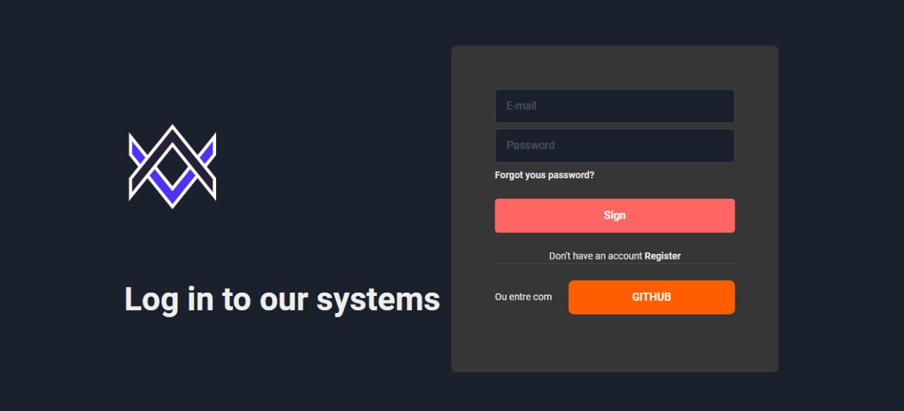

<h1 style="text-align: center;">Página de sign construida em next.js, chakra ui e typescript</h1>

<h1 align="center">
    
</h1>

---
## [Link para aplicação](https://google.com)

## Tecnologias utilizadas

<p>O projeto foi desenvolvido utilizando as seguintes tecnologias</p>

 - [NodeJS](https://nodejs.org/en/)
 - [Next.js](https://nextjs.org/)
 - [React](https://reactjs.org/)
 - [typescript](https://www.typescriptlang.org/)
 - [chakra ui](https://chakra-ui.com/)

---

## Como baixar o projeto
```bash
    #Clonar repositório
    $ git clone 
    
    #Acessar repositório
    $ cd page-sign
```
---
## Instalando programas e dependência para executar a aplicação.
Para baixar as dependência execute os comandos abaixo

```bash
#Instalando dependências necessárias para aplicação
$ yarn install
```

### Iniciando aplicação

```bash
    #Inicia aplicação no http:localhost: 3000
    $ yarn dev
```
---
Desenvolvido por Kevson Filipe.
---